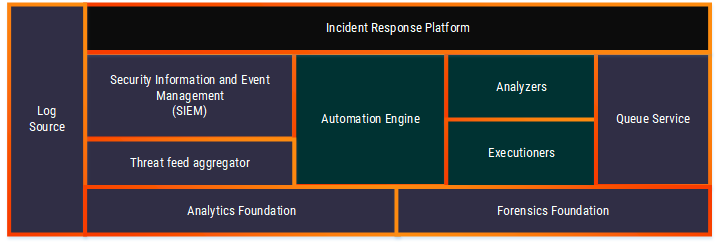

# RationalCyber

A repository containing schematics for an automated cyber security detection &amp; response eco-system (CyOps) with open extendable syntax for practical sharing of use-cases, automation scripts and rules definitions

# The expected values of the project:

+ Standardize the definition of cyber security assessment and handling use-cases
+ Define a credible workflow format with the appropriate functions to support the cyber-security kill chain from start to end and enable automation of processes
+ Define a suggested topology and a technological framework for the enablement of the project

# The Rational stack for cyber operations:

**Stack Modules
| Name          | Open/Closed Source| Enterprise Support| Link  														|
|:-------------|:-----------------| -----------------| :-------------------------------------------------------------:|
| Module        									| Description   																																																																									| 
|:------------------------------------------------- |:----------------------------------------------------------------------------------------------------------------------------------------------------------------------------------------------------------------------------------------------------------------------------------------------------------------- |
| Log Source									   	| Generic module for log input which may vary between different systems, use-cases and organizations (e.g. Syslog, Windows Events, Netflow traffic etc.)																																							|
| SIEM (Security Information and Event Management) 	| System dedicated for the real-time collection, aggregation and inspection of logs from different devices across the network to identify security issues and potential breaches  																																|
| Incident Response Platform 						| System dedicated for the management of security incidents from the initiation of the incident up to the completion of the response and back to "business as usual" 																																				|
| Threat Feed Aggregator      						| Mechanism utilized for the collection of external (not necessarily open source) threat indicators and information which may assist for internal analytics (e.g. vulnerabilities, blacklisted IP's and domains etc.) 																							|
| Automation Engine 								| Mechanism utilized for saving different automation scripts and running them upon demand / on a scheduled runtime basis      																																													|
| Automation Engine Analyzer 						| Subset of the Automation Engine dedicated to data collection /  enrichment / manipulation (e.g. process dump, checking IOC's against threat feeds) 																																								|
| Automation Engine Executioner 					| Subset of the Automation Engine dedicated to active measures (e.g. deletion, Vlan association, shutdown etc.) taking place against different organizational components 																																			|
| Analytics Foundation 								| Module which may represent more than one system aimed at providing an analytical overlay of the information collected and enables utilization of various alrogithms (e.g. Machine learning, Deep learning, Statistical models etc.) to identify abnormalities from the known operation of the organization. 	|
| Forensics Foundation 								| Module which may represent more than one system aimed at enabling identification, preservation, recovery and analysis of forensic data from the organization (e.g. endpoint forensics, network forensics) 																										|
| Que Service 										| Mechanism utilized for the management of different tasks / jobs within the eco-system and continued preseravtion of unfinished tasks (e.g. collect forensics from an offline computer) 																															|

# Curated List of Module Providers

## SIEM (Security Information and Event Management)
| Name          | Open/Closed Source| Enterprise Support| Link  														|
|:-------------|:-----------------| -----------------| :-------------------------------------------------------------:|
| ArcSight      | Closed Source		| N/A 				| [Link](http://www.arcsight.com) 								|
| Splunk        | Closed Source 	| N/A 				| [Link](http://www.splunk.com) 								|
| Elastic Stack | Open Source   	| Yes 				| [Link](https://www.elastic.co) 								|
| IBM Qradar    | Closed Source 	| N/A 				| [Link](https://www.ibm.com/ms-en/marketplace/ibm-qradar-siem) |
| Alien Vault   | Open Source   	| Yes 				| [Link](https://www.alienvault.com/) 							|

## Threat Feed Aggregator
| Name          | Open/Closed Source | Enterprise Support | Link  |
|:-------------:|:------------------:| -----:| -----:|
| Hippocampe    | Open Source   | No  | [Link](https://github.com/CERT-BDF/Hippocampe) |
| C1fApp        | 50/50         | Yes | [Link](https://www.c1fapp.com/) |

## Automation Engine
| Name          | Internal / External / All around Automation | Open/Closed Source |Enterprise Support| Link  |
|:-------------:|:------------------:|:------------------:| -----:| -----:|
| Cortex        | External Automation | Open  Source  | No | [Link](https://github.com/CERT-BDF/Cortex) |
| Hexadite (acquired by Microsoft)   | All around Automation  | Closed  Source  | Yes | [Link](http://hexadite.com/) |
| Phantom cyber | All around Automation  | Closed  Source  | Yes | [Link](https://phantom.us) |

# Contributing

Your contributions are welcome, **[particularly new use-cases and automations](https://github.com/NaorPenso/rationalcyber/use-cases)** that can take away the load off overworked fellow analysts. Please feel free to fork the code, play with it, make some patches and send us pull requests using [issues](https://github.com/NaorPenso/rationalcyber/issues).

We do have a [Code of conduct](code_of_conduct.md). Make sure to check it out before contributing.
